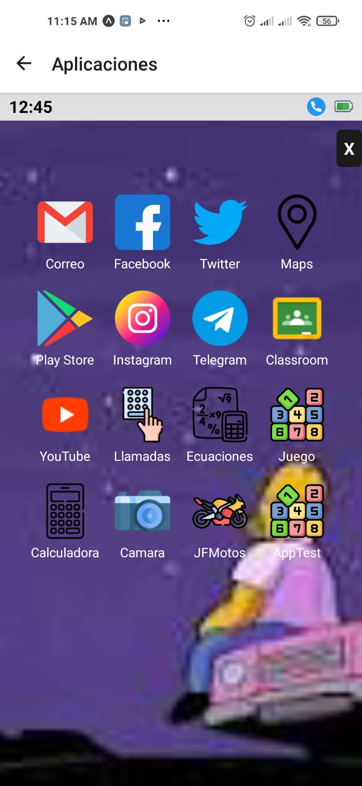

# 👋 ¡Hola! Soy Jonathan Jair Flores Guzman

🎓 Estudiante de Tecnologías de la Información y la Comunicación (TICs)  
📱 Apasionado por el desarrollo de aplicaciones móviles con React Native  
🛠️ Me gusta crear apps funcionales, visuales y ligeras, con código sencillo y entendible  
📍 Puebla, México  

---

## 🚀 Proyectos Destacados

### 🔹 [AppmovilReact](https://github.com/Jonf44/AppmovilReact)
Aplicación móvil tipo sistema operativo que reúne múltiples miniapps en una sola interfaz:  
- 📱 Calculadora  
- 🌐 Navegador hacia Chrome  
- 📸 Acceso a la cámara  
- 📞 Llamadas rápidas  
- 🛵 AppMotos: plataforma de ventas

## 💻 Tecnologías que uso

- React Native · JavaScript · HTML/CSS  
- Git & GitHub · VSCode  
- En proceso de aprender: Python · APIs · Firebase

---

## 📷 Vistazo a mis apps

  
  

---

## 📫 ¿Dónde encontrarme?

- ✉️ jonf44@gmail.com  
- 💻 GitHub: [@Jonf44](https://github.com/Jonf44)

---

Gracias por visitar mi perfil ✨
